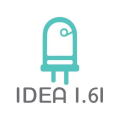

#A7004 module mount

{ width=50% } 

<!---

-->

## OpenSCAD

# How to contribute/Como contribuir

The purpose of making a repository of OpenSCAD codes of parametrizable code is to increase the experience of use and to be able to realize 3D models dina'mica and with practical applications.

To be able to contribute it is necessary to have a gitlab account to be able to make a fork to this repository and later the changes will be reviewed by the administrators and later integrated or returned for review.

Each project must be contained in a folder and it is recommended that in each project there are subfolders called OpenSCAD, PNG, 3Dprint, STL and DXF (in some cases), in the case of the last two folders that have examples of dxf and stl, in addition to it is included a README.md file describing the function and / or reason for the project in question.

El propósito de hacer un repositorio de códigos de OpenSCAD de código parametrizable es aumentar la experiencia de uso y poder realizar modelos 3D dinámica y con aplicaciones prácticas

Para poder contribuir es necesario tener una cuenta de gitlab para poder realizar un fork a éste repositorio y posteriormente los cambios serán revisados por los administradores y posteriormente integrados o regresados para revisión

Cada proyecto debe estar contenido en una carpeta y se recomienda que en cada proyecto existan subcarpetas llamadas OpenSCAD, PNG, 3Dprint,STL y DXF (en algunos casos), en el caso de las dos últimas carpetas que tengan ejemplos de dxf y stl, además de ello que se inluya un archivo README.md en el cual se describa la función y/o motivo del proyecto en cuestión.

# Conduct Code/Código de Conducta

In designs and or 2D and 3D models must not contain inappropriate content or bad taste, this is to contain swear words or models with explicit content or inappropriate for sensitive audiences.

En los diseños y o modelos 2D y 3D no debe contener contenido inapropiado o de mal gusto, esto es contener groserías palabras antisonantes o modelos con contenido explícito o inadecuado para audiencias sensibles.

## IDEA 1.61

{ width=100% } 

https://idea161.org/

https://www.thingiverse.com/

https://www.youtube.com/channel/UCXwIW7z5ys3FRVoOducFSeQ

contacto@idea161.org

## Social

https://www.instagram.com/idea161/

https://www.facebook.com/idea161/

TelegramChannel t.me/idea161

## Disclaimer/Responsiva
          
This contribution is for the purpose of making a contribution to the community and helping with construction.
After reading the Factors to consider, we are not 
responsible for any inconvenience, hoping that these models will be to your liking.
    
Esta contribución es con el fin de hacer un aporte a la comunidad y de ayuda a la construcción.
Después de leer los Factores a considerar, nosotros no nos hacemos responsables por algún inconveniente, esperando que estos modelos sean de su agrado.

## Legal Notice/Anuncio Legal

IDEA1.61 LEGAL NOTICE © Copyright IDEA1.61 2018. All rights reserved. IDEA1.61 logo is a copyrighted work.
DITAC LEGAL NOTICE © Copyright Ditac 2018. All rights reserved. Ditac logos is a copyrighted work.

IDEA1.61 AVISO LEGAL © Copyright IDEA1.61 2018. Todos los derechos reservados. El logotipo de IDEA1.61 es una obra protegida por derechos de autor.
AVISO LEGAL DE DITAC © Copyright Ditac 2018. Todos los derechos reservados. El logotipo de Ditac es una obra protegida por derechos de autor.

